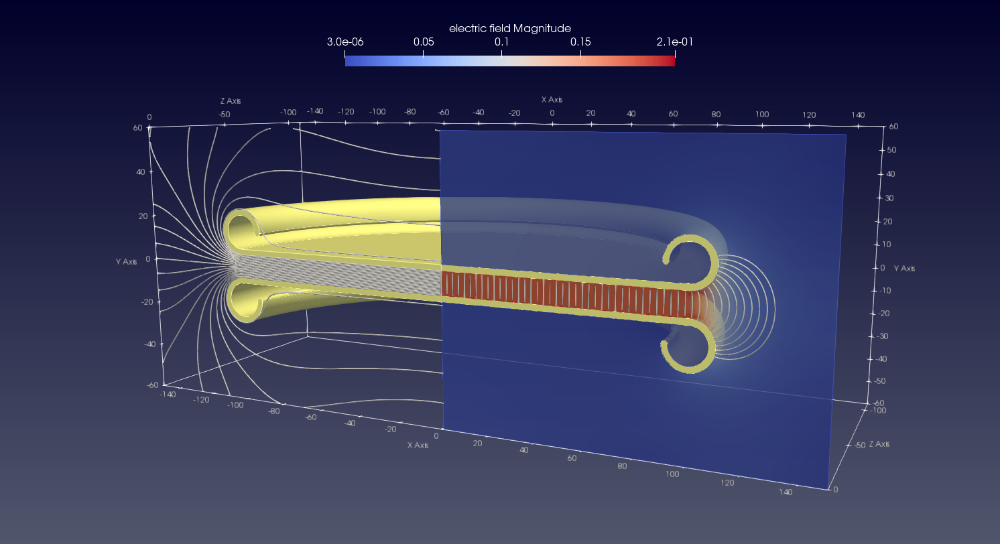

# notebook-fem-opensource

Lectures on the use of open source tools for FEM simulations. 
Jupyter Notebooks in slovak language.

Jupyter Notebook podklady k seminaru Open-Source nastroje pre FEM. Prezentáca použitia programov, postupov pri tvorbe modelov, definovanie podmienok simulácie a vizualizácie výsledkov. Príklady sú zamerané na oblasť elektrostatiky. Inštalácia prostredia a prezentované postupy boli testované na platforme Linux, Fedora 41, prostredie Plasma.

* gmsh, gmsh-api
* pygmsh
* ElmeCSC
* pyelmer
* pyvista
* FreeCAD
* Paraview
* python
* PyCirkuit

Please post questions, additions and suggestions in the discussion.

